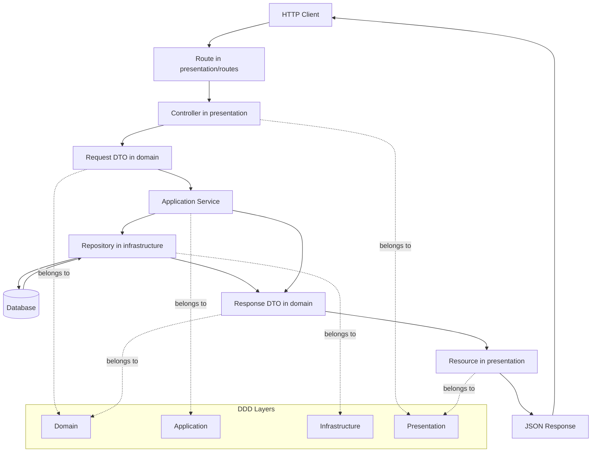

# FerroServer Architecture

This codebase follows a DDD-inspired folder structure with a layered runtime flow.

## DDD Layout

- `src/domain/`
	- Pure business model
	- Entities, DTOs, value objects, shared domain helpers
	- No HTTP, SQL, or framework-specific code

- `src/application/`
	- Use cases and orchestration
	- Coordinates domain logic and repositories
	- Good place for business calculations and workflow logic

- `src/infrastructure/`
	- Technical implementation details
	- Database access, file IO, external services, bootstrap wiring
	- Contains adapters that talk to the outside world

- `src/presentation/`
	- HTTP controllers, routes, resources, serialization
	- Reads request data and formats response JSON

## Where To Put Logic

- Business rules and calculations go in `src/domain/` or `src/application/`.
- SQL, database queries, and transaction handling go in `src/infrastructure/`.
- HTTP request parsing, route registration, and JSON response formatting go in `src/presentation/`.
- Shared DTO base classes and reusable parsing helpers go in `src/domain/shared/`.

### Better Example: Domain vs Application

Suppose you add a structural beam calculator.

Domain example:
- A pure function that calculates beam deflection, bending stress, or load capacity from the beam inputs.
- Input validation that belongs to the calculation itself, such as rejecting a negative span length or invalid material property.
- No database access, no file IO, no HTTP logic.

Application example:
- A use case that loads a beam design from the database, reads the span and material data, calls the beam formula, and returns a result DTO.
- A workflow that combines multiple domain rules, for example computing beam deflection and then updating a project summary or feasibility report.
- Coordination only, not the formula itself.

In short:
- domain decides the business rule
- application decides when and how to run that rule

For calculator-style features:
- Put the pure formula in `src/domain/<feature>/`.
- Put orchestration around the formula in `src/application/<feature>/`.
- Put file IO, database access, or API calls needed by the calculator in `src/infrastructure/`.
- Put any HTTP endpoint for the calculator in `src/presentation/`.

Rule of thumb:
- if it decides what is true in the business, it belongs in domain or application
- if it talks to the database or another external system, it belongs in infrastructure
- if it deals with HTTP or JSON, it belongs in presentation

Short version:
- formula = domain
- use case = application
- data access = infrastructure
- endpoint = presentation

## Runtime Flow

1. Route calls a controller in `src/presentation/`.
2. Controller parses the request body into a DTO from `src/domain/`.
3. Controller calls an application service in `src/application/`.
4. Service validates and orchestrates the use case.
5. Service calls a repository in `src/infrastructure/`.
6. Repository loads or stores data and returns DTOs.
7. Controller uses a resource class in `src/presentation/` to build JSON.
8. Controller sends the HTTP response.

## Folder Responsibilities

### Domain

Location: `src/domain/*`

Use it for:
- DTOs and entities
- Value objects
- Shared validation helpers
- Pure business concepts

Keep it free of HTTP, SQL, and file system code.

### Application

Location: `src/application/*`

Use it for:
- Use cases
- Business validation
- Calculations and orchestration
- Coordinating repositories and domain objects

This is where logic like "calculate todos per project" belongs.

### Infrastructure

Location: `src/infrastructure/*`

Use it for:
- SQL repositories
- File IO
- External integrations
- Bootstrap and technical wiring

Infrastructure should not contain business decisions.

### Presentation

Location: `src/presentation/*`

Use it for:
- Horse controllers
- Route registration
- JSON resource mappers
- HTTP status codes and request/response handling

Presentation should not contain SQL or business rules.

## Base DTO Pattern

Shared base class:
- `src/domain/shared/base_dto.pas`

`TBaseDTO` provides reusable request parsing and validation helpers:
- Parse request body as a JSON object
- Require string fields
- Require boolean fields

Model DTO classes such as `TTodoDTO` and `TProjectDTO` inherit from `TBaseDTO` and expose model-specific factory methods such as:
- `FromCreateJSON`
- `FromUpdateJSON`

The request DTO passed into a service does not need to match the response DTO returned by that service. The service may return a richer, thinner, or transformed DTO if that better matches the use case.

Resources can also build nested JSON responses. For example, a project details resource can include a `todos` collection even if the request DTO only contains project fields.

## Ownership Rules

DTOs are class instances, so ownership is explicit:

- Presentation owns request DTOs and frees them.
- Application services return response DTOs; presentation frees them after rendering.
- Repository list methods return owned object lists such as `TObjectList` descendants with `OwnsObjects=True`.

Keeping ownership explicit avoids leaks and double free errors.

## Example Placement

- `src/domain/todo/todo_dto.pas` for Todo transport objects
- `src/domain/project/project_dto.pas` for Project transport objects
- `src/application/todo/todo_service.pas` for Todo use cases
- `src/application/project/project_service.pas` for Project use cases
- `src/infrastructure/todo/todo_repository.pas` for Todo SQL access
- `src/infrastructure/project/project_repository.pas` for Project SQL access
- `src/presentation/todo/todo_controller.pas` for Todo HTTP handlers
- `src/presentation/project/project_controller.pas` for Project HTTP handlers
- `src/presentation/todo/todo_resource.pas` for Todo JSON rendering
- `src/presentation/project/project_resource.pas` for Project JSON rendering
- `src/infrastructure/bootstrap/server_bootstrap.pas` for startup wiring

## Why This Pattern

Benefits:
- Clear separation of concerns
- Reusable validation and parsing logic
- Strongly typed data flow instead of generic JSON everywhere
- Easier unit testing per layer
- Predictable API response formatting

## Adding A New Entity

For a new entity, keep the same pattern:

1. Add DTO classes in `src/domain/<feature>/`
2. Add application services in `src/application/<feature>/`
3. Add repositories in `src/infrastructure/<feature>/`
4. Add resources and controllers in `src/presentation/<feature>/`
5. Register routes from `src/presentation/routes/`
6. Wire startup from `src/infrastructure/bootstrap/`

This keeps all modules consistent and easier to maintain.
